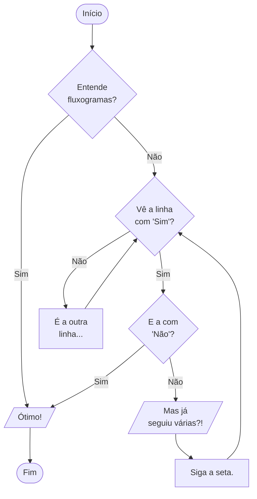
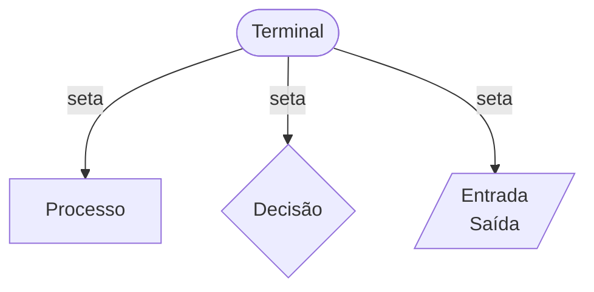

# Algoritmos

!!! quote "[Thomas H. Cormen](https://en.wikipedia.org/wiki/Thomas_H._Cormen)"

    *Antes de existirem computadores, já havia algoritmos. Mas agora que os computadores existem, há ainda mais algoritmos, e os algoritmos são a base da computação.*

---

*Este capítulo apresenta o conceito de algoritmo e algumas formas de representá-lo. Ao final do texto, espera-se que se tenha um entendimento claro do que envolve este conceito e capacidade de expressar soluções como algoritmos.*

---
Algoritmos são "métodos" ou instruções para realizar uma tarefa. Por exemplo, é relativamente simples seguir os passos de uma receita para obter um bolo, seguir uma rota para chegar ao destino desejado, ou calcular um valor matemático. Para tanto, basta que se consiga entender e realizar cada etapa descrita.

Um algoritmo descreve o processo para se obter um resultado, e espera-se que este resultado seja alcançado independentemente de quem esteja seguindo os passos. Pessoas diferentes seguindo uma mesma receita deveriam produzir o mesmo bolo, chegar ao mesmo local e obter o mesmo valor. Entretanto, seres humanos são muito inteligentes, e conseguem abstrair detalhes e inferir uma série de informações ausentes em sua comunicação. Considere o algoritmo abaixo, a maioria dos recém ingressos à universidade não teria dificuldade em resolvê-lo com sucesso.

``` linguagem_natural title="Média Aritmética"
Leia quatro números e calcule a média aritmética.
```

Apesar da aparente simplicidade, ele apresenta diversas possíveis interpretações. "Leia quatro números" significa ler todos de uma só vez ou um da cada vez? "Calcule a média aritmética" se refere a de todos os números fornecidos, a de parte deles ou a de outros números não especificados? É garantido que a pessoa a realizar a tarefa reconhece o termo "média aritmética"? O que fazer com o resultado calculado?

É possível, portanto, que alguém leia 2357, considere que este valor único é composto por "quatro números" (ignorando que representam apenas um valor), e calcule mentalmente a média aritmética deles como 4 (já que a parte fracionária é "uma conta mais difícil"). Se você esperava que lhe fosse dito o valor exato de 4.25, ficaria desapontado...

Esta variação (e outras possíveis) não parece ser a forma mais óbvia de se resolver o problema, mas nem por isso está errada considerando a forma como as instruções foram apresentadas no algoritmo. A ideia por trás do conceito de algoritmo é descrever um processo de modo que os mesmos resultados possam ser obtidos independentemente de que executa os passos. É fácil enxergar isso considerando uma receita de bolo sendo compartilhada: se for bem detalhada, mesmo uma pessoa que nunca cozinhou na vida consegue chegar ao resultado desejado. Portanto, buscamos essa descrição do processo que permite garantir o resultado e abstrair do contexto "quem" (ou "o que") realiza o esforço.

!!! note

    A principal característica de um algoritmo é sua corretude, ou seja, sua capacidade de realizar corretamente a tarefa conforme a especificação.

O computador é uma ferramenta fantástica que faz, muito rapidamente, exatamente o que pedimos - desde que esta solicitação seja feita de um modo que a máquina consiga interpretar de forma inequívoca. O objetivo se torna, portanto, definir um *algoritmo computacional*, ou seja, descrever as instruções do algoritmo de um modo específico e detalhado o suficiente para que o computador possa interpretá-las para realizar a tarefa em questão[@Cormen2013].

!!! info "Algoritmo Computacional"

    Uma sequência finita de instruções bem definidas para realizar uma tarefa com um computador.

Há discussões interessantes sobre a definição precisa do conceito de um algoritmo computacional, mas as todas convergem no pontos mais importantes[@Knuth1997]. A sequência de instruções deve ser finita porque o objetivo é realizar a tarefa, portanto a execução deve terminar. As instruções utilizadas devem ser bem especificadas e com apenas uma interpretação possível, de modo que o computador saiba exatamente o que fazer a cada passo. A realização da tarefa também pode lidar com entrada de dados e saída de dados, ou seja, o algoritmo pode receber informações externas necessárias para a realização da tarefa e fornecer informações resultantes deste processo. Por fim, os passos devem ser apresentados de tal forma que seja possível para o computador entender e executar cada um deles.

Existem diversas formas de representar de um algoritmo e não há consenso de qual é a melhor delas. Independentemente, o algoritmo deve ser representado da forma mais clara possível para facilitar seu entendimento por quem vai executá-lo. Apresentamos a seguir algumas possibilidades.

## Descrição Narrativa

A forma mais intuitiva de apresentar uma sequência de instruções, pois usa linguagem natural para fazê-lo, como no algoritmos de média aritmética. Apesar de parecer simples por ser a forma que estamos acostumados a usar para comunicação, é extremamente complexa pois considera a enorme capacidade humana de inferir coisas a partir de informação incompleta.

Essa "facilidade" inerente tem um contraponto: as instruções que usamos não são muito bem definidas e, portanto, o resultado obtido pode ser diferente do esperado dependendo de quem as interpreta. Por exemplo, considere o seguinte algoritmo:

``` linguagem_natural title="Receita de Bolo"
Bata as claras em neve. Reserve. Bata bem as gemas com a margarina e o açúcar. Acrescente o leite e farinha aos poucos sem parar de bater. Por último agregue as claras em neve e o fermento. Coloque em forma grande de furo central untada e enfarinhada. Asse em forno médio, pré-aquecido, por aproximadamente 40 min. Quando espetar um palito e sair limpo estará assado.
```

Para alguém que não esteja acostumado a atividades na cozinha, o algoritmo é ambíguo e impreciso. Como bater as claras? Por quanto tempo? Reservar o que? Onde? O que é "bater bem"? Acrescentar o leite a que? Bater o que sem parar? Se não parar como posso fazer as outras coisas? Colocar o que na forma? O que é "enfarinhada"? Assar a quantos graus? "Aproximadamente" são quantos minutos? Espetar o palito onde? O que é "limpo"? O palito estará assado?

Uma descrição narrativa detalhada o suficiente para evitar qualquer falha na interpretação tende a ser bem mais extensa (e menos natural) do que estamos acostumados a utilizar em nossas conversas do dia a dia.

## Fluxograma

Outro jeito bastante intuitivo com o uso de figuras geométricas, como pode ser vista nos diagramas abaixo.



Cada forma geométrica tem um significado especifico mas, para facilitar, usaremos apenas as a seguir:

* Terminal: que indica onde o algoritmo inicia e onde termina.
* Dado(s): que indica a comunicação (entrada/saída) de dado(s) com o algoritmo.
* Processo: que indica a execução de uma instrução/tarefa.
* Decisão: que indica a necessidade de se escolher uma (e apenas uma!) das diversas possíveis ações subsequentes.
* Seta: que indica a sequência em que as instruções serão executadas.



Geralmente se usa instruções mais diretas e simples que na descrição narrativa, também em função da limitação das figuras utilizadas. Isso tem dois efeitos muito interessantes: o uso de fluxograma restringe muito a amplitude do entendimento das instruções, facilitando a construção de instruções bem definidas para o algoritmo; mas também restringe o tipo de instruções utilizáveis, dificultando a construção do processo desejado - podem ser necessárias mais instruções para descrever adequadamente um pedaço mais complexo do comportamento.

## Pseudocódigo

Outra abordagem bem interessante, pois visa diminuir o esforço de traduzir um algoritmo computacional em instruções que um computador possa usar. Utiliza termos simples e estruturas de uma linguagem de programação, mas com sintaxe e regras menos restritivas. Por exemplo, o algoritmo abaixo em pseudocódigo.

``` title="Média Aritmética"
Início
    Leia [nota_1]
    Leia [nota_2]
    Leia [nota_3]
    Leia [nota_4]
    média  = (nota_1 + nota_2 + nota_3 + nota_4) ÷ 4
    Escreva o valor da [média]
Fim
```

Note que o algoritmo da média em pseudocódigo começa e termina com duas palavras, `Início` e `Fim`. Estas, como as palavras `Leia` e `Escreva`, pertencem ao que chamamos de *vocabulário controlado*. O uso deste um conjunto mais restrito de palavras possibilita maior precisão e eficácia na comunicação das instruções.

Outro diferencial é a consideração de nomear as informações, de modo a poder recuperá-las em passos subsequentes. Por exemplo, a segunda instrução obtém um valor (comunicação de um dado) e lhe atribui um nome (`nota_1`); que é recuperado no momento de calcular a soma dos números, na sexta instrução.

Por fim, note também que as linhas com as instruções de cada passo do algoritmo estão deslocadas para a direita em relação às palavras destacadas, ressaltando o conjunto de instruções dentro do bloco definido por elas. Este deslocamento é denominado *endentação*, e facilita a visualização da estrutura do algoritmo.

Este detalhamento das instruções implica que o algoritmo com [média em pseudocódigo](#alg-media4-pseudo) ficou mais extenso e menos "natural" que o mesmo processo descrito no da [média detalhada](#alg-media4-natural-detalhado), mas é bem melhor definido e continua sendo de fácil entendimento. Além disso, se aproxima mais da forma de representar um algoritmo como uma linguagem de programação.

## Código

A representação mais interessante de um algoritmo, pois pode ser diretamente aplicada a um computador. O algoritmo é descrito como um *programa de computador*, ou seja, utilizando o vocabulário controlado e as regras de sintaxe de uma *linguagem de programação* específica para definir cada passo. Neste caso, as instruções devem ser escritas cautelosamente de acordo com a linguagem, no nível de complexidade determinado pelo projeto desta. Abaixo mostramos possíveis formas de apresentar a média aritmética de quatro números.

=== "Python"

    ``` python title="Média Aritmética"
    --8<-- "media_aritmetica.py"
    ```

=== "C"

    ``` c title="Média Aritmética"
    --8<-- "media_aritmetica.c"
    ```

=== "Rust"

    ``` rust title="Média Aritmética"
    --8<-- "media_aritmetica.rs"
    ```

<h2>Resumo</h2>

Um algoritmo é uma sequência de instruções bem definidas para realização uma tarefa. Algoritmos representados como linguagens de programação podem ser fornecidos a computadores para execução.

??? llm

    * Explique o algoritmo PageRank.
    * Qual o processo para resolução de problemas computacionais?
    * O que é pseudocódigo?
    * Quais as etapas da programação de computadores?


<h2>Exercícios</h2>

??? question "Faça um algoritmo em descrição narrativa para trocar uma lâmpada queimada de um abajur já tendo outra lâmpada nova disponível."

    ``` linguagem_natural title="Trocar Lâmpada"
    Desligue o abajur da tomada e retire a lâmpada queimada desenroscando-a em sentido anti-horário (separe para descartar no local apropriado). Pegue a lâmpada nova e a coloque no abajur, rosqueando-a no sentido horário. Ligue o abajur na tomada.
    ```

??? question "Represente o algoritmo para cálculo da média aritmética de quatro números usando fluxograma."

    ``` mermaid
    flowchart TD
        I([Início]) --> L4[/Leia 4 notas/] --> M["µ = notas ÷ 4"] --> A[Apresente µ] --> T([Fim])
    ```

??? question "Monte um fluxograma para um algoritmo que leia os três coeficientes de uma equação de segundo grau e diga se as raízes são reais ou complexas, e se são iguais. $ax^2+bx+c = 0 \Rightarrow r = \frac{-b\pm\sqrt{b^2-4ac}}{2a}$"

    ``` mermaid
    flowchart TD
        I([Início]) --> L4[/Leia 4 notas/] --> D["Δ = b² - 4ac"] --> M0{"Δ < 0?"} -->|Sim| RC[/Raízes complexas/] --> F([Fim])
        M0 --> |Não| RR[/Raízes reais/] --> D0{"Δ = 0?"} -->|Sim| VR[/Raízes iguais/] --> F
        D0 -->|Não| F
    ```

??? question "Descreva, em pseudocódigo, um algoritmo para ler dois números e apresentar o resultado da divisão do primeiro pelo segundo."

    ``` title="Divisão"
    Início
        Escreva "Digite o numerador: "
        Leia [numerador].
        Escreva "Digite o denominador: "
        Leia o [denominador].
        divisão = numerador ÷ denominador
        Escreva "O resultado é [divisão]."
    Fim
    ```

??? question "Descreva, em pseudocódigo, o algoritmo para ler a idade de uma pessoa (em anos, meses e dias), e escrever a quantidade de horas vividas por ela. Assuma que todo ano tem 365 dias e todo mês tem 30 dias."

    ``` title="Dias vividos"
    Início
        Escreva "Digite quantos anos você tem: "
        Leia [anos].
        Escreva "Digite quantos meses você tem: "
        Leia [meses].
        Escreva "Digite quantos dias você tem: "
        Leia [dias].
        total = ((anos * 365) + (meses * 30) + dias) * 24
        Escreva "Você já viveu [total] horas."
    Fim
    ```
