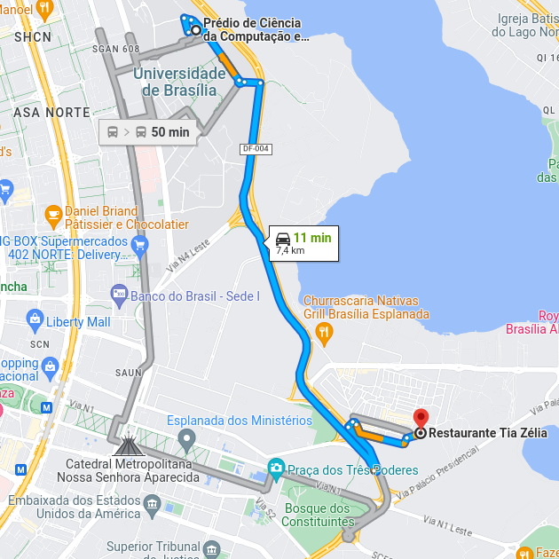
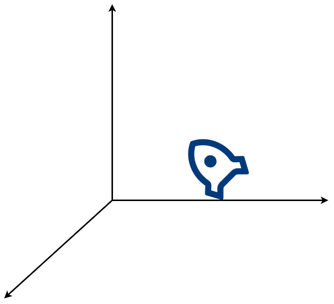
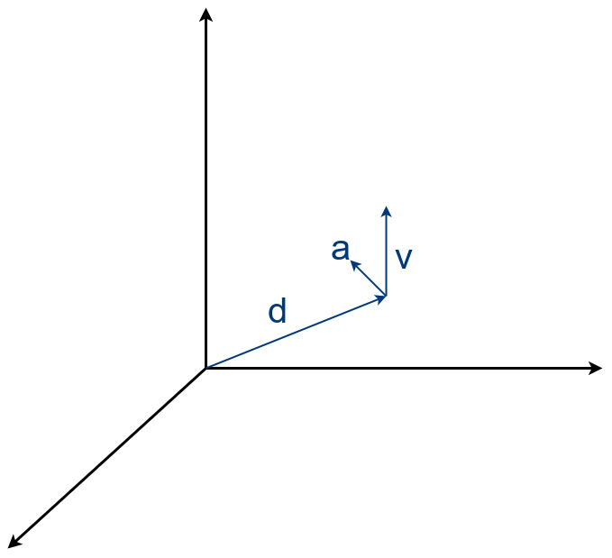
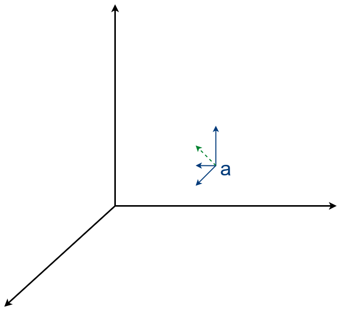
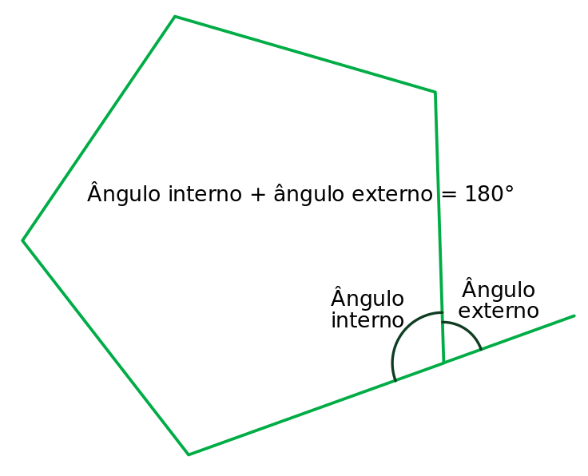
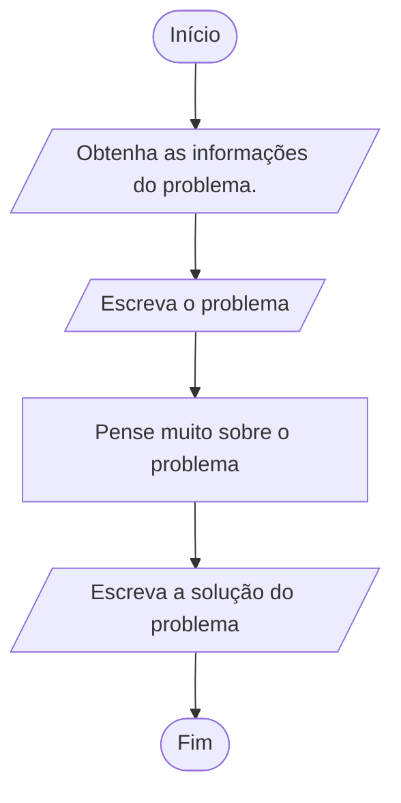

# Pensamento Computacional

!!! quote "[Albert Einstein](https://pt.wikipedia.org/wiki/Albert_Einstein)"

    *Não podemos resolver um problema usando o mesmo tipo de pensamento que usamos quando os criamos.*

---

*Este capítulo apresenta as principais ideias do pensamento computacional e como elas podem ser aplicadas. Ao final do texto, espera-se que se tenha uma noção de como eles podem são utilizados na resolução de problemas diferentes.*

---

Um aspecto da vida cotidiana é o fluxo de atividades, muitas destas com um propósito específico. Nelas, é muito comum se ter um objetivo em mente e ponderar sobre como atingi-lo para, então, elaborar uma sequência de passos que levem ao mesmo. Pode-se considerar que chegar ao objetivo é um *problema* a ser resolvido, e que os passos adequados compõem sua *solução*. Uma vez determinada a solução para um problema específico, espera-se que ela funcione para toda instância do problema. Por exemplo, uma receita é uma solução adequada para se ter um bolo, e toda vez que se quiser o bolo, bastaria seguir a receita. Esta solução resolve até o problema de outras pessoas! Desde que elas queiram este mesmo bolo...

A obtenção de uma solução pode ser um processo criativo complexo, com etapas de elaboração, implementação e verificação. Quando funciona, este processo pode ser muito satisfatório, afinal quem não gosta de bolo? Claro, esta ideia também se aplica a outros problemas. É possível definir os passos para montar um móvel (manual de instruções), para conseguir lidar com a demanda de clientes em uma instituição (filas e prioridades), e muito mais.

Um *algoritmo* pode ser considerado como uma descrição dos passos necessários para resolver o problema, ou seja, representa uma solução que poderia ser executada por um agente qualquer. O *computador* é uma máquina capaz de interpretar e executar certas instruções, podendo ser o agente que executa o algoritmo, desde que este seja representado com as instruções específicas que o computador entenda. Assim, para que a máquina resolva nossos problemas, devemos guiar o processo de elaboração de soluções como uma atividade de criação de um algoritmo computacional, que é a descrição precisa de um procedimento para realizar uma tarefa, de modo que um computador possa executá-la[@Cormen2013].

O *pensamento computacional* é o processo envolvido na formulação de problemas de modo que suas soluções possam ser representadas como etapas computacionais e algoritmos[@Aho2011]. São os processos mentais envolvidos na descrição de um problema de tal forma que a solução possa ser executada por uma pessoa ou por um computador[@Wing2014]. Como a computação tem permeado cada vez mais nossa vida, e a noção do pensamento computacional tem sido incorporada como conhecimento desejável para uma pessoa. Uma proposta é que o aluno se torne um "pensador computacional"[@ISTE2018] e, neste caso, espera-se que ele aprenda a:

* desenvolver e usar estratégias para resolver problemas com tecnologia;
* formular problemas para serem resolvidos com a ajuda da tecnologia como coleta e análise de dados, abstração e aplicação de algoritmos;
* decompor problemas, extrair as informações relevantes e conseguir produzir modelos que facilitem a resolução d problemas;
* entender como a automação funciona junto ao pensamento algorítmico para juntar etapas manuais em soluções automatizadas.

Essencialmente, o pensamento computacional envolve habilidades de converter problemas reais, que são complexos, confusos e mal definidos, em algo que um autômato sem inteligência (o computador) consiga resolver sem auxílio de alguém[@BCS2014]. Há muitos conceitos envolvidos[@Google], como coleta e análise de dados, representação de dados e paralelização - vale a pena procurar saber mais sobre eles! Os principais conceitos do processo são apresentados a seguir.

## Abstração

Abstrair é o processo de identificar um conjunto de características invariantes fundamentais a algo[@Burgoon2013]. É reconhecer similaridades entre objetos ou situações de um problema e focar apenas nelas, ignorando as especificidades para facilitar a forma como tratar o problema[@Cansu2019].

Por exemplo, o problema de cultivar uma rosa vermelha. Como buscamos o processo de mantê-la saudável, podemos assumir que este processo independe da cor e, portanto, abstrair este detalhe para cultivar uma rosa. Se for uma espécie de rosa mais robusta, podemos abstrair novamente e simplificar o problema para o cultivo de uma flor. Dependendo da espécie, talvez possamos dar um passo além e reduzir o problema para "como cultivar uma planta?" (dar mais um passo e considerar como manter um ser vivo é possível, mas excessivo neste contexto).

A abstração é um processo inerente no contexto de pensamento computacional, pois é preciso transformar o problema e sua solução em representações abstratas em um programa de computador. Por exemplo, podemos ter todos os inúmeros detalhes de uma cidade, como distribuição de casas e lojas, tamanhos de construções, cores, população, consumo energético, formas de movimentação, etc. Entretanto, para descobrir a rota da sua posição até uma loja, podemos abstrair quase tudo e considerar apenas com uma representação de certas localizações e dos acesso entre elas.

 | 
:---------:|:---------:
UnB "Real" | Abstração

## Decomposição

A decomposição é o processo de separar o problema em partes, ou subproblemas, de modo que cada um deles seja menor e mais simples - portanto mais fácil de ser resolvido. Esse processo pode ser repetido até que se tenha um problema simples o suficiente para elaborar uma solução. Depois, basta juntar as soluções de cada subproblema de forma coesa para obter a solução do problema original.

O primeiro passo para decompor um problema é entendê-lo corretamente de modo a identificar e descrever os processos (e subproblemas) envolvidos na sua resolução. Com essa informação, é possível particionar os processos (e subproblemas) em passos distintos, que então são organizados de forma estruturada para que possam ser executados.
O primeiro passo para decompor um problema é entendê-lo corretamente de modo a identificar e descrever os processos (e subproblemas) envolvidos na sua resolução. Com essa informação, é possível particionar os processos (e subproblemas) em passos distintos, que então são organizados de forma estruturada para que possam ser executados.

Por exemplo, para calcular a trajetória de um foguete, é mais fácil decompor o movimento dele nas componentes aceleração, velocidade e deslocamento e considerar o efeito de cada uma. A decomposição continua ao tratá-las, pois cada uma pode ser decomposta em componentes específicos do sistema de coordenadas sendo utilizado. Num sistema cartesiano, a aceleração é tratada como a variação da posição ao longo do tempo nos eixos, portanto a análise pode ser decomposta para cada eixo $x$, $y$ e $z$.

 |  | 
:------:|:------------------------:|:-------------------------:
Foguete | Componentes do movimento | Componentes da aceleração

E o processo pode continuar até que as tarefas seja exequíveis.

## Generalização

Generalizar é criar modelos, regras, princípios ou teorias que se adequem à uma classe de problemas partir de padrões observados em instâncias específicas do problema. A ideia é que, partindo de uma solução correta, esta seja adaptada de modo que possa ser aplicada em problemas similares.

Por exemplo, um triângulo equilátero tem os 3 ângulos internos iguais a 60° e as 3 linhas com o mesmo comprimento. A partir disso, é relativamente simples definir um algoritmo que desenhe um. Da mesma forma, um quadrado tem os 4 ângulos internos iguais a 90° e as 4 linhas com o mesmo comprimento, e também é simples desenhar um, basta criar linhas com os ângulos adequados. Considerando o pentágono regular, é possível perceber que as soluções são muito similares... A solução proposta constrói o desenho de modo que cada linha continua a partir do fim da linha anterior, usando o ângulo externo do polígono para a rotação.

{ width="50%" } |
:------:|
Propriedade dos ângulos interno/externo |

=== "Triângulo"

    ``` linguagem-natural title="Triângulo Equilátero"
    ângulo_interno = 60°
    ângulo_externo = 180° - ângulo_interno
    Desenhe uma linha de comprimento L.
    Gire a caneta em ângulo_externo no sentido anti-horário.
    Desenhe uma linha de comprimento L.
    Gire a caneta em ângulo_externo no sentido anti-horário.
    Desenhe uma linha de comprimento L.
    ```

=== "Quadrado"

    ``` linguagem-natural title="Quadrado"
    ângulo_interno = 90°
    ângulo_externo = 180° - ângulo_interno
    Desenhe uma linha de comprimento L.
    Gire a caneta em ângulo_externo no sentido anti-horário.
    Desenhe uma linha de comprimento L.
    Gire a caneta em ângulo_externo no sentido anti-horário.
    Desenhe uma linha de comprimento L.
    Gire a caneta em ângulo_externo no sentido anti-horário.
    Desenhe uma linha de comprimento L.
    ```

=== "Pentágono"

    ``` linguagem-natural title="Pentágono Regular"
    ângulo_interno = 72°
    ângulo_externo = 180° - ângulo_interno
    Desenhe uma linha de comprimento L.
    Gire a caneta em ângulo_externo no sentido anti-horário.
    Desenhe uma linha de comprimento L.
    Gire a caneta em ângulo_externo no sentido anti-horário.
    Desenhe uma linha de comprimento L.
    Gire a caneta em 1ângulo_externo no sentido anti-horário.
    Desenhe uma linha de comprimento L.
    Gire a caneta em ângulo_externo no sentido anti-horário.
    Desenhe uma linha de comprimento L.
    ```

Nos algoritmos, os ângulos e a quantidade de linhas são diferentes, mas também é possível reconhecer um padrão nas instruções. A propriedade geométrica de polígonos determina que [id> a soma de todos os ângulos externos de um polígono é 360°](https://pt.wikipedia.org/wiki/%C3%82ngulos_internos_e_externos#Propriedades), e como os ângulos são iguais, é possível determinar o ângulo para cada forma geométrica apenas com a informação de quantos lados ela tem. Assim, pode-se rescrever os algoritmos e chegar a uma solução genérica que atende qualquer polígono regular.

=== "Triângulo"

    ``` linguagem-natural title="Triângulo Equilátero"
    ângulo_externo = 360 / 3

    Desenhe uma linha de comprimento L.
    Gire a caneta em ângulo_externo graus no sentido anti-horário.

    Desenhe uma linha de comprimento L.
    Gire a caneta em ângulo_externo graus no sentido anti-horário.

    Desenhe uma linha de comprimento L.
    Gire a caneta em ângulo_externo graus no sentido anti-horário.
    ```

=== "Quadrado"

    ``` linguagem-natural title="Retângulo Regular"
    ângulo_externo = 360 / 4

    Desenhe uma linha de comprimento L.
    Gire a caneta em ângulo_externo graus no sentido anti-horário.

    Desenhe uma linha de comprimento L.
    Gire a caneta em ângulo_externo graus no sentido anti-horário.

    Desenhe uma linha de comprimento L.
    Gire a caneta em ângulo_externo graus no sentido anti-horário.

    Desenhe uma linha de comprimento L.
    Gire a caneta em ângulo_externo graus no sentido anti-horário.
    ```

=== "Pentágono"

    ``` linguagem-natural title="Pentágono Regular"
    ângulo_externo = 360 / 5

    Desenhe uma linha de comprimento L.
    Gire a caneta em ângulo_externo graus no sentido anti-horário.

    Desenhe uma linha de comprimento L.
    Gire a caneta em ângulo_externo graus no sentido anti-horário.

    Desenhe uma linha de comprimento L.
    Gire a caneta em ângulo_externo graus no sentido anti-horário.

    Desenhe uma linha de comprimento L.
    Gire a caneta em ângulo_externo graus no sentido anti-horário.

    Desenhe uma linha de comprimento L.
    Gire a caneta em ângulo_externo graus no sentido anti-horário.
    ```

=== "Polígono"

    ``` linguagem-natural title="Polígono Regular"
    ângulo_externo = 360 / número_de_lados

    Repita número_de_lados vezes:
        Desenhe uma linha de comprimento L.
        Gire a caneta em ângulo_externo graus no sentido anti-horário.
    ```

=== "Python + Turtle"

    ``` python title="Polígono Regular"
    --8<-- "turtle/poligono_regular.py:7:11"
    ```

## Projeto de Algoritmos

O passo final do pensamento computacional é criar uma sequência de instruções que resolve o problema. O ponto chave é guiar o raciocínio. Para tanto, é preciso considerar uma série de coisas. Qual o objetivo principal? Como abstrair o contexto? Como decompô-lo em partes mais acessíveis? Em que ordem estas partes devem ser tratadas?

!!! info "Pensamento Algorítmico"

    Processo de construir uma sequência de passos ordenados que pode ser seguida para obter uma solução para todos os problemas constituintes necessários para resolver o problema original[@Cansu2019].

A aplicação do pensamento algorítmico depende de certas informações sobre o problema. Quais as informações fornecidas? O que se espera como resultado? O que se deve fazer depende de certas condições? Há alguma parte que precisa ser repetida?

!!! note

    Duas ideias que ajudam este processo são: 1) se perguntar "E se eu fizesse desse jeito?" (explorando formas diferentes de resolver o problema); e 2) explicar a sua solução a alguém (ou a um [pato de borracha](https://pt.wikipedia.org/wiki/Debug_com_Pato_de_Borracha)), ao tentar ensinar uma solução [você estará efetivamente aprendendo sobre ela](https://degraucultural.com.br/noticia/ensinar-e-uma-das-melhores-formas-de-aprender-entenda).

Com um entendimento adequado do problema e seu contexto, pode-se projetar o algoritmo. Mais detalhes sobre isso serão discutidos no próximo capítulo, mas o grande [Richard Feynman](https://pt.wikipedia.org/wiki/Richard_Feynman) tem um abordagem praticamente infalível para isso:



É claro, alguns problemas [não têm solução](https://pt.wikipedia.org/wiki/Lista_de_problemas_em_aberto) e outra abordagem seria "consigo mostrar que ele não pode ser resolvido?" (e assim determinar a solução que é "não é possível resolver"). Independentemente, a parte mais importante do pensamento computacional é, obviamente, o raciocínio aplicado no projeto da solução.

## Avaliação

A avaliação visa garantir que a solução algorítmica é adequada, ou seja, que resolve o problema. Há diversas propriedades que podem/devem ser verificadas.

* Corretude: o algoritmo é correto se fornece o resultado correto para toda entrada válida[@Cormen2009].
* Eficiência: o algoritmo é eficiente se consome o mínimo de recursos possíveis para fornecer um resultado; geralmente o foco é em *tempo* (o quão rápido é sua execução).
* Usabilidade: o quão fácil é para usar, lembrar e aprender o algoritmo[@Jain2023].

A corretude é a principal característica, as demais não têm importância se a solução que não resolve o problema. Também é um conceito ardiloso[@Cormen2013] pois pode depender do contexto. Por exemplo, um algoritmo que aproxima o valor de $\pi$ pode ser correto num contexto em que a precisão de 2 casas decimais é suficiente (por exemplo, apresentando resultados simples à pessoas), mas incorreto em outro onde a precisão necessariamente deve ser bem maior (como calculando trajetórias de naves espaciais). A eficiência não é o foco da parte inicial mas será discutida no capítulo de estruturas de dados, e pode ser uma característica fundamental da solução em certos contexto (como o piloto automático de uma aeronave). Noções de usabilidade e legibilidade do código permeiam o texto e serão destacadas quando apropriado.

Esta verificação é um processo complexo, que pode ser feita de diversas formas. A mais simples é testar o resultado obtido para situações conhecidas, e fazer isso na totalidade das condições possíveis ou numa abrangência adequada. Quando isto não é possível (talvez por que demore demais), há outras formas, como verificar as situações antes (pré-condição) e depois (pós-condição) de cada passo no algoritmo, ele será correto se e somente se ambas forem verdadeiras.

## Automação

O uso de mecanismos para realização de um processo específico tem uma série de vantagens. Provavelmente aumenta a eficiência na produção dos resultados e a uniformidade destes, reduz a incidência de erros e viabiliza o recurso humano para lidar com outras atividades. Além disso, muitas tarefas cotidianas são repetitivas e poderiam ser realizadas por um computador dadas as instruções corretas[@Sweigart2020].

Parte importante deste processo é o entendimento do que pode ser computado e também do que não pode ser. O computador existe como entidade física e opera dentro de certos limites. Portanto, apesar de podermos planejar soluções matematicamente corretas, é possível que estas não possam ser executadas na máquina. Por exemplo, há [métodos para calcular o valor exato de π](https://pt.wikipedia.org/wiki/Pi#M%C3%A9todos_de_s%C3%A9ries_infinitas), mas o resultado é um valor irracional e o processo para calcular o valor exato também é infinitamente demorado!

$$\pi = 4\cdot\sum\limits_{n=0}^{\infty}\frac{(-1)^n}{2n+1}$$

Além disso, certas operações podem demandar que uma quantidade inviável de informações seja armazenada, ou que sejam realizados tantos processos que se torna impraticável aguardar o término da computação (se ocorrer). O processo de formulação de uma solução algorítmica necessariamente deve considerar essas limitações de modo a chegar a uma opção que seja realizável.

Outro aspecto relevante neste processo é que, para ser realizada por um computador, a tarefa e deve ser programada de tal modo que os padrões de interação envolvidos escondam, mas não retirem os detalhes do contexto. Em Ciência da Computação, essa abstração é o processo de eliminar especificidades ao ignorar certas características e de esconder informações que não sejam necessárias[@Colburn2007], o que permite que os padrões de interações entre processos sejam aplicáveis em diversos contextos.

<h2>Resumo</h2>


??? llm

    * O que é pensamento computacional?
    * O que é pensamento algorítmico?
    * De forma simplificada, o que é corretude de um algoritmo?
    * De forma simplificada, o que é eficiência de um algoritmo?
    * De forma simplificada, o que é usabilidade de um algoritmo?

<h2>Exercícios</h2>

??? question "Há dois cubos aparentemente idênticos, sendo um um pouco mais leve que o outro. Aplique o pensamento computacional para elaborar uma solução para o problema de, tendo acesso a uma balança digital, encontrar o mais pesado."

    O processo pode ser decomposto em duas etapas: análise de um cubo e comparação dos resultados da análise. A solução pode ser descrita em 7 passos: 1) por o primeiro cubo na balança, 2) anotar sua massa, 3) por o segundo cubo na balança, 4) anotar sua massa, 5) comparar os valores anotados, 6) identificar qual o de maior massa e 7) apresentação do cubo mais pesado.

??? question "Há dois bolos aparentemente idênticos, sendo um pouco mais leve que o outro. Aplique o pensamento computacional para elaborar uma solução para o problema de, tendo acesso a uma balança de dois pratos (que não indica a massa, mas apenas qual dos pratos está com mais peso), encontrar o bolo mais leve."

    Este é um problema diferente do anterior, mas alguns detalhes podem ser abstraídos: ao invés de bolos ou cubos, considera-se que há objetos a serem pesados; e em vez de um valor específico para a massa de cada objeto, tem-se um mecanismo que fornece o resultado direto da comparação entre eles. Novamente o processo pode ser decomposto em duas etapas: disposição dos objetos na balança e análise da inclinação dos pratos. A solução pode ser descrita em 2 passos: 1) por cada objeto em um prato na balança e 2) apresentar o objeto que estiver no prato mais alto. Isso poderia ser facilmente adaptado para o problema de achar o objeto mais pesado.

??? question "Considere 1000 cubos aparentemente idênticos, sendo um deles um pouco mais pesado que os demais. Aplique o pensamento computacional para elaborar uma solução para o problema de encontrar o cubo mais pesado."

    Uma abordagem é aproveitar o comportamento descrito na questão anterior. Ao comparar dois cubos, se os pratos estiverem desalinhados sabe-se que o que estiver no prato mais baixo é o desejado. Caso contrário, basta descartar um deles e substituí-lo por outro cubo ainda não avaliado. Estes passos são repetidos até que se ache o mais pesado, o que pode levar até 999 comparações na balança.

    Alternativamente, retomando a abstração de que é um "cubo" pode ser considerado como um "objeto", a solução descrita continua aplicável. Pode-se abstrair um pouco mais, considerando que o "objeto" a ser pesado é, na verdade, um conjunto de cubos. É fácil adaptar a solução para identificar qual o conjunto mais pesado, basta posicionar a metade dos cubos em cada prato. Embora isso não forneça ainda qual o cubo mais pesado, permite identificar em qual dos pratos ele está e, portanto, que se descarte o outro conjunto (onde ele *não* está). Então, tem-se um novo conjunto de cubos que pode ser separado em duas partes iguais para comparação na balança e subsequente descarte da parte mais leve. Esse processo é repetido até que torne possível identificar inequivocadamente o cubo mais pesado. No caso de 1000 cubos, seriam necessárias, no máximo, 10 comparações na balança!

??? question "Considere uma quantidade ímpar de cubos aparentemente idênticos, sendo um deles um pouco mais leve que os demais. Como encontrar o cubo mais leve usando uma balança de dois pratos."

    Pode-se aproveitar a ideia anterior para separá-los em três partes, dois conjuntos com a mesma quantidade de cubos e um cubo a parte. Aos posicionar os conjuntos nos pratos, se não houver desnível, o cubo separado é o mais pesado do conjunto. Se houver, pode-se descartar os cubos do prato mais pesado e também o que foi separado, e repetir o processo com os cubos remanescentes.

??? question "Nas soluções anteriores, como é possível verificar que o processo é correto?"

    Há algumas possibilidades. É possível que a objeto mais pesado possa ser identificado de outra forma (por exemplo, com uma marcação invisível a olho nu), portanto o processo o cubo indicado sempre for o marcado. Outra forma é avaliando se cada passo está correto. No caso da balança de dois pratos, sempre que houver pelo menos um objeto, o prato mais baixo indica o que é mais pesado (mesmo que haja dois com o mesmo peso!). Isso também é verdade se forem dois conjuntos de objetos, um em cada prato, ou seja, cada pesagem corretamente indica o conjunto mais pesado. Se este passo é avaliado como correto, diferentes repetições dele também o serão. Ou seja, ao pesar uma vez e descartar o conjunto mais leve, tem-se novamente o problema de achar o objeto mais pesado em um conjunto menor de objetos - uma versão menor do mesmo problema de antes! O processo de comparação e descarte, que é correto, pode ser repetido até que haja somente dois objetos, situação que já foi mostrada que pode ser resolvida corretamente.
